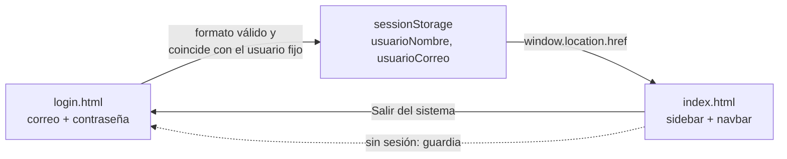
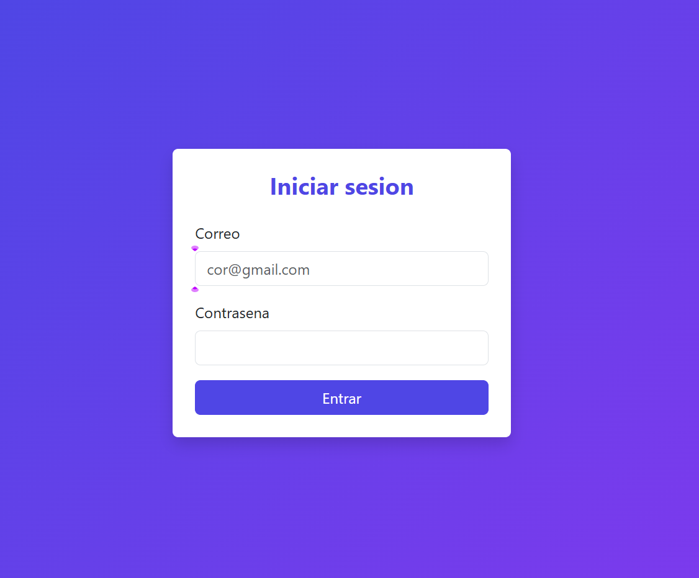
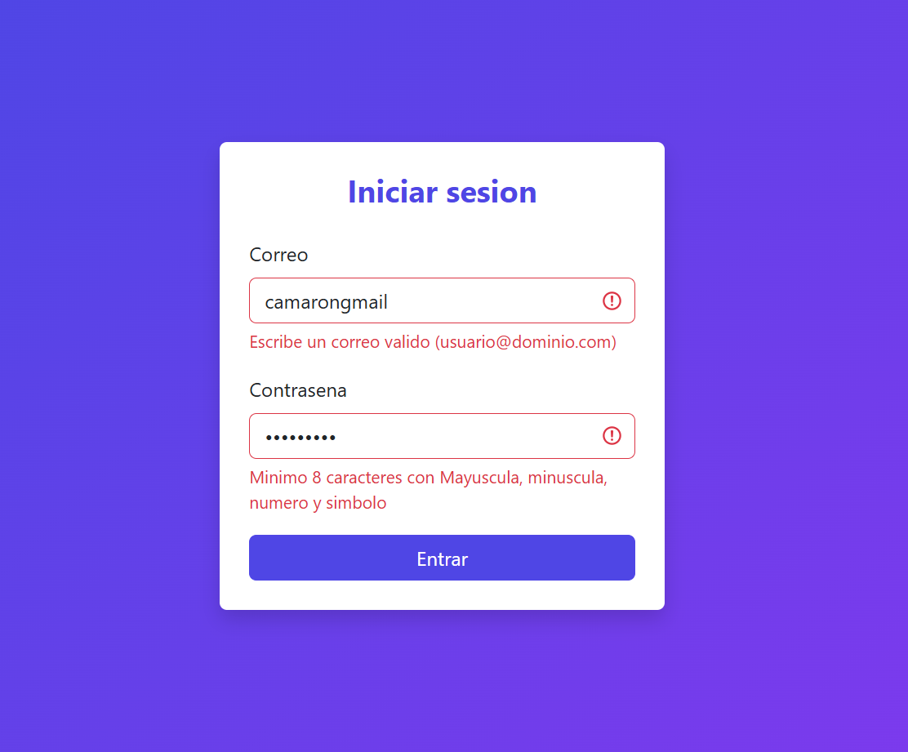
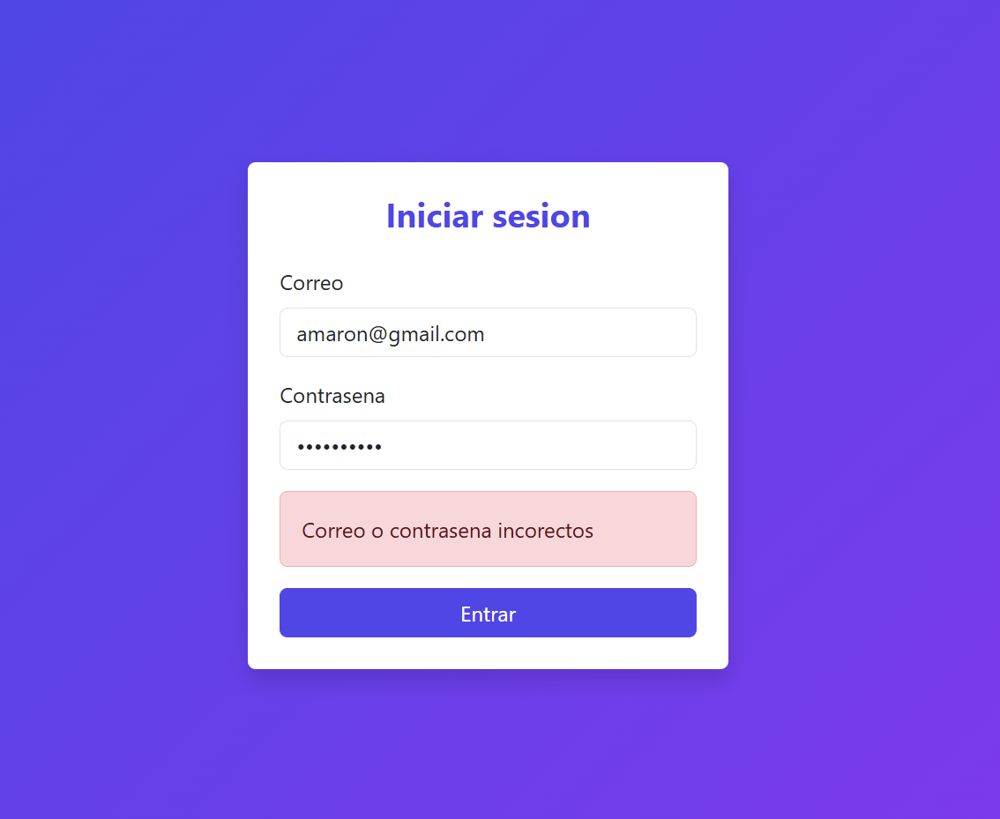
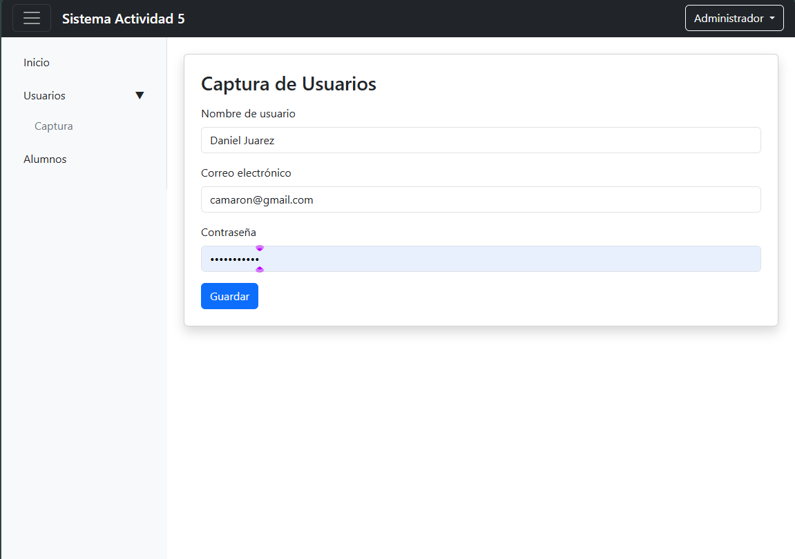
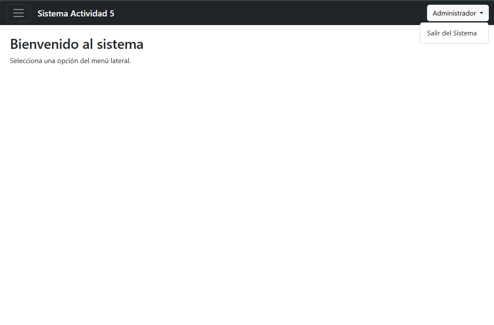

#  Sistema de Acceso: Login y Panel

> Actividad 5 · Programacion Web·  7SC · Martinez Nieto Adelina

Login funcional **simulado** (sin backend) que da acceso a un panel con sidebar, navbar con el usuario en sesión, formularios validados y un modal de edad. Construido con **HTML, CSS, JavaScript y Bootstrap 5**, integrando la librería propia [`utileria.js`](https://github.com/DaniielA5/utileria-js).

| | |
|---|---|
| 🌐 **Demo en vivo (GitHub Pages)** | https://daniiela5.github.io/login-sistema-web/ |
| 📁 **Repositorio** | https://github.com/DaniielA5/login-sistema-web |

##  Integrantes

| Integrante | GitHub | Responsabilidad |
|---|---|---|
| Daniel Juarez | [@DaniielA5](https://github.com/DaniielA5) | Login (HTML, CSS y validación), manejo de sesión, navbar con usuario y opción Salir, bloqueo de `index.html` sin sesión, README |
| [Nombre Isaac] | [@Isaac051225](https://github.com/Isaac051225) | Sidebar con botón hamburguesa y submenú, navegación entre secciones, formulario de Captura, formulario de Alumnos con número de control, modal de edad, diseño responsive |

##  Usuario de prueba

El inicio de sesión es simulado con un usuario fijo definido en `js/login.js`:

| Campo | Valor |
|---|---|
| Correo | `camaron@gmail.com` |
| Contraseña | `Camaron123!` |

##  Tecnologías

- HTML5, CSS3 y JavaScript (sin frameworks de JS)
- **Bootstrap 5.3.3** como base de estilos
- **utileria.js**, librería propia de validaciones, cargada desde CDN

---

#  Documentación

## Framework CSS utilizado

Usamos **Bootstrap 5.3.3** cargado desde el CDN de jsDelivr (no se mezcla con Tailwind ni con otro framework):

```html
<link rel="stylesheet" href="https://cdn.jsdelivr.net/npm/bootstrap@5.3.3/dist/css/bootstrap.min.css">
```

- `login.html` usa **solo el CSS** de Bootstrap.
- `index.html` agrega además `bootstrap.bundle.min.js` (incluye Popper), necesario para el **dropdown** del navbar, el **submenú colapsable** del sidebar y el **modal**.
- Componentes usados: grid (`container`, `row`, `col-*`), `card`, `form-control`, `invalid-feedback` / `is-invalid`, `alert`, `navbar`, `dropdown`, `collapse` y `modal`, además de utilidades como `d-none`, `d-flex` y `shadow`.
- Los estilos propios están en `css/login.css` (degradado de fondo y colores del botón mediante variables `--bs-btn-*`) y en `css/index.css` (sidebar y diseño del panel).

## Flujo del login hacia el sistema



1. El usuario escribe correo y contraseña en `login.html` y presiona **Entrar**.
2. `login.js` cancela el envío normal del formulario (`event.preventDefault()`) y valida el formato con `validarCorreo()` y `validarPassword()` de `utileria.js`. Si algo es inválido, marca el campo con la clase `is-invalid` y Bootstrap muestra el mensaje.
3. Si el formato es correcto, compara los datos con el usuario fijo `USUARIO_FIJO`. Si no coinciden, muestra la alerta *"Correo o contraseña incorrectos"*.
4. Si coinciden, guarda el usuario en `sessionStorage` y redirige a `index.html`.
5. `index.html` carga `sesion.js`, que lee la sesión, muestra el nombre en el navbar y activa el botón Salir.
6. Al elegir **Salir del sistema** se borra la sesión y se regresa a `login.html`.
7. Si alguien abre `index.html` sin haber iniciado sesión, `sesion.js` lo regresa al login (guardia).

## Cómo se pasa el nombre de usuario del login al navbar

`login.html` e `index.html` son dos páginas distintas y las variables de JavaScript se pierden al cambiar de página, por eso usamos **`sessionStorage`**, que conserva los datos mientras la pestaña esté abierta y los borra al cerrarla (a diferencia de `localStorage`, que no caduca).

**En `login.js`** (al validar correctamente):

```js
sessionStorage.setItem("usuarioNombre", USUARIO_FIJO.nombre);
sessionStorage.setItem("usuarioCorreo", correo);
window.location.href = "index.html";
```

**En `sesion.js`** (al cargar `index.html`):

```js
const nombre = sessionStorage.getItem("usuarioNombre");
if (!nombre) { window.location.replace("login.html"); return; }
document.getElementById("nombreUsuario").textContent = nombre;
```

Nunca se guarda la contraseña. Para escribir en el navbar se usa `textContent` (y no `innerHTML`) para que el dato se trate como texto y no como HTML.

## Métodos principales

### Funciones de `utileria.js` que se utilizan

La librería se carga desde CDN en ambas páginas:

```html
<script src="https://cdn.jsdelivr.net/gh/DaniielA5/utileria-js@main/js/utileria.js"></script>
```

| Función | Qué hace | Dónde se usa |
|---|---|---|
| `validarCorreo(correo)` | Valida el formato `usuario@dominio.tld` | Login y formulario de Captura |
| `validarPassword(password)` | Mínimo 8 caracteres con mayúscula, minúscula, número y símbolo | Login y formulario de Captura |
| `soloLetras(texto)` | Acepta solo letras (con acentos y ñ) y espacios | Nombre del alumno |
| `calcularEdad(fecha)` | Calcula la edad en años | Modal de edad |
| `esMayorDeEdad(fecha)` | Indica si la persona tiene 18 años o más | Modal de edad |

### Funciones y métodos propios

| Método | Archivo | Qué hace |
|---|---|---|
| `marcarCampo(input, divError, esValido, mensaje)` | `login.js` | Pone o quita `is-invalid` en un campo y escribe su mensaje de error |
| `formLogin.addEventListener("submit", ...)` | `login.js` | Valida el formulario, compara con el usuario fijo, guarda la sesión y redirige |
| `sessionStorage.setItem / getItem / removeItem` | `login.js`, `sesion.js` | Guarda, lee y borra la sesión |
| `window.location.href = "..."` | `login.js` | Redirige a `index.html` |
| `window.location.replace("...")` | `sesion.js` | Redirige sin dejar la página anterior en el historial (guardia y Salir) |
| `event.preventDefault()` | formularios | Evita que el formulario recargue la página |
| `classList.add / remove / toggle` | todos | Muestra u oculta elementos y marca errores |
| `textContent` | `sesion.js`, `login.js` | Escribe texto plano en la página |

##  Estructura del proyecto

```
login-sistema-web/
├── index.html        → sistema (sidebar, navbar, formularios, modal)
├── login.html        → pantalla de acceso
├── README.md
├── css/
│   ├── login.css     → estilos del login
│   └── index.css     → estilos del sistema
├── js/
│   ├── login.js      → validación del login y creación de la sesión
│   ├── sesion.js     → nombre en el navbar, Salir y guardia
│   └── index.js      → sidebar, formularios y modal
└── img/              → capturas del README
```

`utileria.js` no está en la carpeta `js/` porque se carga desde el CDN de jsDelivr.

---

#  Proceso de creación

## Parte de DaniielA5

### Paso 1: Preparar el repositorio
Creamos el repositorio público `login-sistema-web` en GitHub, lo vinculamos con la carpeta local (`git init`, `git remote add origin ...`), agregamos a Isaac como colaborador y creamos la estructura de carpetas `css/`, `js/` e `img/`.

### Paso 2: Base de `index.html`
Armamos el esqueleto de `index.html` con Bootstrap por CDN: el navbar oscuro con el botón hamburguesa y el dropdown de usuario, y las zonas vacías (`#sidebar` y las secciones `#seccion-captura` y `#seccion-alumnos`) para que Isaac trabajara en paralelo sobre sus propios archivos.

### Paso 3: Estructura de `login.html`
Construimos una tarjeta (`card`) centrada con el grid de Bootstrap. El `<form>` lleva `novalidate` para desactivar la validación nativa del navegador y que validen nuestras funciones. Cada campo tiene un `div.invalid-feedback`, que Bootstrap muestra solo cuando el input tiene la clase `is-invalid`.



### Paso 4: Estilos del login (`login.css`)
Agregamos un fondo con degradado, esquinas redondeadas en la tarjeta y personalizamos el color del botón sobrescribiendo las variables `--bs-btn-*` de Bootstrap.

### Paso 5: Validación del login (`login.js`)
Al enviar el formulario se validan correo y contraseña con `validarCorreo()` y `validarPassword()`, mostrando ambos errores a la vez, y después se comparan con el usuario fijo. Si los datos no coinciden aparece una alerta general.




### Paso 6: Guardar el usuario y redirigir
Cuando todo es correcto, se guardan `usuarioNombre` y `usuarioCorreo` en `sessionStorage` y se redirige a `index.html` con una ruta relativa, para que funcione igual en local y en GitHub Pages.

### Paso 7: Nombre del usuario en el navbar
`sesion.js` lee `usuarioNombre` de `sessionStorage` y lo escribe en el `<span id="nombreUsuario">` del navbar.



### Paso 8: Salir del sistema y bloqueo sin sesión
El dropdown del navbar incluye **Salir del sistema**, que borra las dos claves de `sessionStorage` y regresa a `login.html` con `location.replace`. Además, si `index.html` se abre sin sesión, se redirige automáticamente al login.



## Parte de Isaac

>   CHAY completar cada paso con 2 o 3 líneas explicando como se hizo  y una captura.

### Paso 9: Sidebar y botón hamburguesa
> 


### Paso 10: Formulario de Captura de usuarios
>  Cómo se validan nombre de usuario, correo y contraseña con `validarCorreo` y `validarPassword`.


### Paso 11: Formulario de Alumnos y número de control
>  Cómo se valida el número de control de 6 dígitos (solo números y longitud exacta).


### Paso 12: Modal de edad
>  Cómo se calcula la edad con `calcularEdad` y `esMayorDeEdad` y cómo se abre el modal.


---

#  Flujo completo funcionando

**login → index → salir**

| 1. Login | 2. Sistema con el usuario | 3. Salir del sistema |
|---|---|---|
|  |  |  |

#  Limitaciones

- La sesión es **simulada** y vive en el navegador. Cualquiera puede crear la clave en `sessionStorage` desde la consola, y el usuario y la contraseña son visibles en el código fuente. En un sistema real esta validación la hace un servidor.
- Se necesita conexión a internet para cargar Bootstrap y `utileria.js` desde sus CDN.

#  Cómo ejecutarlo

1. Abre el [enlace de GitHub Pages](https://daniiela5.github.io/login-sistema-web/), o clona el repositorio y abre `login.html` (por ejemplo con XAMPP o Live Server).
2. Inicia sesión con el usuario de prueba.
3. Prueba el menú lateral, los formularios y el modal.
4. Usa **Salir del sistema** en el navbar para regresar al login.